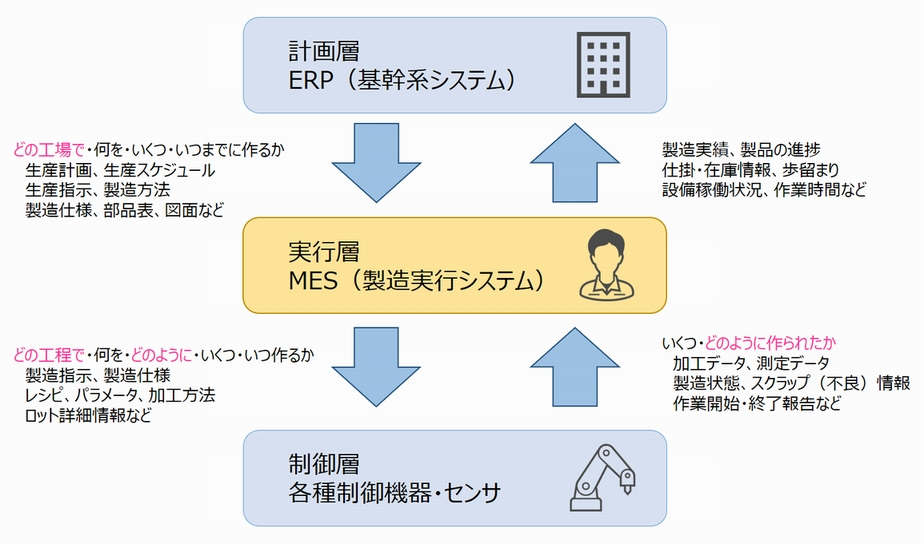

# MES

- 製造実行システム
- Manufacturing Execution System

## 概要
製造業での運用されるシステムでは，生産現場に近い位置で運用されるシステムであり，
主に以下の目的で運用される

- 製造工程への製造指示や現場作業者の支援
- 生産実績データの収集や分析
- 製品の品質管理や生産設備のメンテナンス

立ち位置としては，上位層のITシステム([[ERP]])と生産設備の制御機器/センサの中間に位置しており，収集したデータと全体の生産計画に基づいて，生産現場での[[QCD]]改善と安定化の補助に貢献する．

[[ERP]]が企業全体の生産計画を立てるのに対して，MESは各生産計画の工程をプランニングする役割がある．

現場では，MESが策定した工程に基づいて生産を行い，MESはその実績データを[[ERP]]にフィードバックする．

MESの工程を，設備に反映する作業は人間もしくは[[SCADA]]により実施される．

## MESにおける11の機能
MESには以下の機能が搭載されている([[MESA]]の定義)
1. 生産資源の配分と監視
    - 生産設備や作業者などの生産資源を適切に配分して状況を監視する。
2. 作業者管理
    - 作業者の作業状況を管理して最適な作業を割り当てる。
3. 作業のスケジューリング
    - 計画層の生産計画を受けて詳細なスケジュールを策定する。
4. 製造指示
    - 作業スケジュールに基づいて製造指示や変更指示を行う。
5. プロセス管理
    - 生産状況を監視して異常発生時の作業者の対応を支援する。
6. データ収集
    - 生産設備の稼働状況や作業者の作業状況のデータを収集する。
7. 実績の分析
    - 蓄積した生産実績データから生産状況の良し悪しを分析する。
8. 設備の保守・保全管理
    - 生産設備の保守・保全活動の計画・実行を管理する。
9. 製品品質管理
    - 製品品質データを収集して品質異常の有無を管理する。
10. 製品の追跡と製品体系の管理
    - 生産途中の仕掛品の追跡管理や次工程の管理を行う。
11. 仕様・文書管理
    - 製品仕様書や作業手順書などの生産に必要な文書を管理する
___
## MOC
- [[ERP]]
- [[SCADA]]

## 参考
- IoT用語辞典 : [Keyence](https://www.keyence.co.jp/ss/general/iot-glossary/mes.jsp)
- MESとは? : [富士電機製品コラム](https://www.fujielectric.co.jp/about/column/detail/fa_11.html)

[//begin]: # "Autogenerated link references for markdown compatibility"
[ERP]: ERP.md "ERP"
[SCADA]: SCADA.md "SCADA"
[//end]: # "Autogenerated link references"