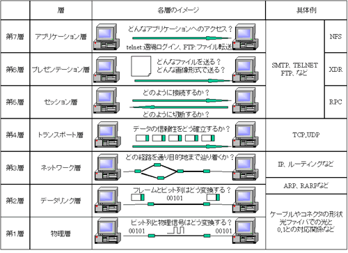

# OSI基本参照モデル
ネットワーク通信で必要な機能(プロトコル)を7つの階層に分けて定義したモデル．

各要素の役割を分類し，明確化する目的で規定される．

| 階層 | 名称                 | 概要                                 | プロトコル例               |
| ---- | -------------------- | ------------------------------------ | -------------------------- |
| L7   | アプリケーション層   | アプリケーション固有のデータ規定     | HTTP，FTP，電子メール      |
| L6   | プレゼンテーション層 | データフォーマットに関する規定       | 文字コード，圧縮，暗号方式 |
| L5   | セッション層         | 接続制御と管理                       | TLS                        |
| L4   | トランスポート層     | データの転送保証に関する規定         | [[TCP／IP]]，[[UDP]]       |
| L3   | ネットワーク層       | アドレス管理とルーティング           | IPv4，IPv6                 |
| L2   | データリンク層       | 通信区間のデータ送受信               | Ethernet，Wi-Fi            |
| L1   | 物理層               | 物理的な仕様の規定(通信ケーブルなど) | 有線ケーブル，無線         |

## 参照
- Wikipedia: [OSI参照モデル](https://ja.wikipedia.org/wiki/OSI%E5%8F%82%E7%85%A7%E3%83%A2%E3%83%87%E3%83%AB)
- 日立情報通信エンジニアリング: [OSI参照モデルの話（第2回）　～7つのレイヤと企業基幹ネットワーキング～](https://www.hitachi-ite.co.jp/column/20.html)
- MM-LABO.COM: [OSI参照モデル](https://www.mm-labo.com/computer/tcpip/basic/OSI.html)

[//begin]: # "Autogenerated link references for markdown compatibility"
[TCP／IP]: TCP%EF%BC%8FIP.md "TCP／IP"
[UDP]: UDP.md "UDP"
[//end]: # "Autogenerated link references"