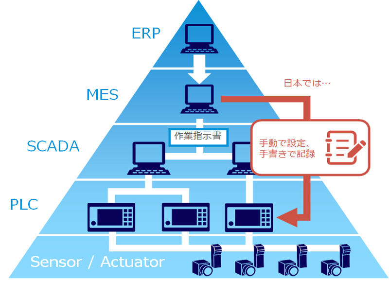

# SCADA

- Supervisory Control and Data Acquisition
- 日本語 : 監視制御とデータ取得

## 概要
SCADAは，製造設備の**監視制御システム**．
設備・装置のプロセス上のデータを一元管理することで，リモートでの監視及びコントロールを可能にする．

[[ERP]]や[[MES]]といった，上位の計画・実行層と設備・PLCやセンサの中間に配置され，データの橋渡しを行う目的で運用される．

SCADA自体が設備を直接的に制御することはなく，個々の機器の制御はPLC等の設備に組み込まれた制御ユニットが実行し，SCADAはその制御ループの監視を行う目的で配置される．

データの収集は接続された各PLCレベルで行われ，SCADAはそのデータをオペレータが監督できるような形式に処理したうえで提示を行う([[HMI]])．

### 調査メモ
- 上位の計画・実行層(ERP/MES)と操作センシング層(機器設備・PLC/センサ)との橋渡しを行う
- 日本では[[MES]]の結果をセンシング層に反映する処理を人間に行わせている傾向がある(あった)
  - この人の部分がSCADAに当たるらしい
  - つまり，[[MES]]は操作機器に対して直接指令を与えるわけではない．
- [[HMI]](Human Machine Interface)を提供して，機器の状態を人に表示するのもSCADAの役目
  - 人が機器の操作をHMIから行える機能も必要
ルを提供する

## 参考
- Wikipedia : [SCADA](https://ja.wikipedia.org/wiki/SCADA)
- TTS : [SCADAとは？MESとの違いや導入するメリット、主な機能を紹介](https://www.tbts.co.jp/useful/column/iot-ai/what-is-scada/)
- LINX : [向上のIoT化はどのように進めていくべきなのか? ソフトウェアプラットフォームzenonという選択](https://linx.jp/linx_express/i19320/linx_express_i19320.php)

[//begin]: # "Autogenerated link references for markdown compatibility"
[ERP]: ERP.md "ERP"
[MES]: MES.md "MES"
[//end]: # "Autogenerated link references"