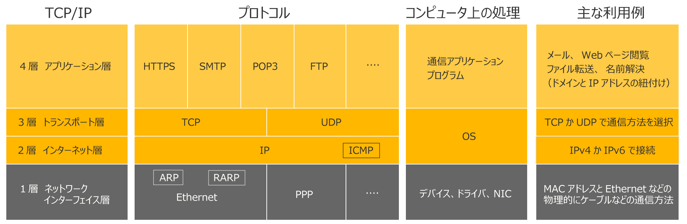

# TCP／IP
- Transmission Control Protocol / Internet Protocol

現在，世界標準的に利用されている通信プロトコル．

[[TCP]]と[[IP]]のそれぞれのプロトコルを用いて通信を行う規格．

https://www.itmanage.co.jp/column/tcp-ip-protocol/

## 参考
- アイティーエム: [TCP/IPとは？](https://www.itmanage.co.jp/column/tcp-ip-protocol/)

[//begin]: # "Autogenerated link references for markdown compatibility"
[TCP]: TCP.md "TCP"
[IP]: IP.md "IP"
[//end]: # "Autogenerated link references"