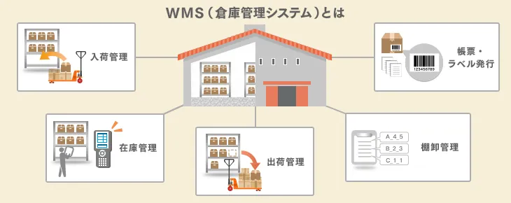

# WMS

- Werehouse Management System

## 概要
倉庫内の在庫管理と，商品の入出荷数を一元管理するソフトウェアシステム．

## 機能
- 入荷管理
- 在庫管理
- 出荷管理
- 棚卸管理
- 帳票・ラベル発行
- 返品管理
- ピッキング最適化
- 安全在庫管理
- オーダーマネジメント
- レポートと分析

## 参考
- ITトレンド: [WMSとは？倉庫管理システムの基本やメリット・デメリットも解説](https://it-trend.jp/warehouse_management_system/article/system)

